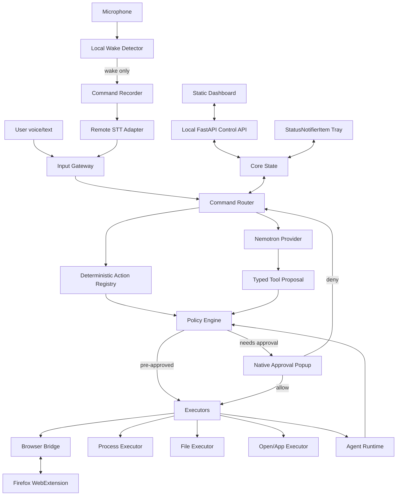

# Project H — Architecture V2

## 1. High-level architecture



## 2. Process model

### Resident

Prefer one process:

`project-hd`

Responsibilities:
- asyncio event loop;
- wake audio capture;
- wake detection;
- core state;
- command routing;
- policy engine;
- provider client;
- action registry;
- file/process executors;
- SQLite state;
- D-Bus status-notifier integration;
- localhost control API.

### Transient

- native approval popup process;
- Firefox native messaging bridge if Firefox launches a native host;
- user-approved commands;
- optional dashboard browser tab.

Avoid a permanent second Python service unless measurement proves isolation is worth the extra memory.

## 3. Suggested source tree

```text
project-h/
├── pyproject.toml
├── config.example.toml
├── app/
│   ├── main.py
│   ├── lifecycle.py
│   ├── core/
│   │   ├── events.py
│   │   ├── state.py
│   │   ├── command_router.py
│   │   └── errors.py
│   ├── voice/
│   │   ├── audio.py
│   │   ├── wake.py
│   │   ├── recorder.py
│   │   ├── vad.py
│   │   └── stt.py
│   ├── ai/
│   │   ├── base.py
│   │   ├── nvidia.py
│   │   ├── tools.py
│   │   └── transcript.py
│   ├── actions/
│   │   ├── schema.py
│   │   ├── registry.py
│   │   ├── matcher.py
│   │   └── composite.py
│   ├── policy/
│   │   ├── engine.py
│   │   ├── decision.py
│   │   ├── approvals.py
│   │   └── risk.py
│   ├── executors/
│   │   ├── process.py
│   │   ├── files.py
│   │   ├── browser.py
│   │   └── xdg.py
│   ├── browser/
│   │   ├── protocol.py
│   │   └── native_bridge.py
│   ├── agents/
│   │   ├── model.py
│   │   ├── runtime.py
│   │   └── verifier.py
│   ├── storage/
│   │   ├── sqlite.py
│   │   └── audit.py
│   ├── tray/
│   │   └── status_notifier.py
│   ├── api/
│   │   ├── app.py
│   │   ├── routes_*.py
│   │   └── schemas.py
│   └── web/
│       ├── index.html
│       ├── css/
│       │   ├── bootstrap.min.css
│       │   └── app.css
│       ├── js/
│       │   ├── app.js
│       │   ├── api.js
│       │   ├── router.js
│       │   └── core-animation.js
│       └── icons/
├── extension/
│   └── firefox/
│       ├── manifest.json
│       ├── background.js
│       ├── native.js
│       ├── generic.js
│       └── adapters/
│           ├── google.js
│           ├── amazon.js
│           ├── chatgpt.js
│           ├── gemini.js
│           └── claude.js
├── packaging/
│   ├── project-h.service
│   ├── native-messaging-manifest.json
│   └── install-user.sh
├── actions.d/
│   ├── core.json
│   └── developer.json
└── tests/
```

## 4. Dependency rules

Allowed:

```text
api/tray/voice
      ↓
core
      ↓
command router
      ↓
action registry / ai
      ↓
policy
      ↓
executors
```

Forbidden:
- executor calling policy after execution;
- provider calling OS directly;
- web extension bypassing daemon policy;
- dashboard calling shell directly;
- action JSON importing code;
- agent directly opening arbitrary files outside file executor.

## 5. Command flow

### Deterministic command

```text
"VS Code kholo"
 -> local normalized text
 -> action matcher
 -> action app.open_vscode
 -> policy says pre-approved
 -> process executor argv=["code"]
 -> result
```

No Nemotron call.

### Complex command

```text
"repo ka failing test fix karo"
 -> router cannot resolve deterministic single action
 -> Nemotron gets goal + tool schemas + bounded context
 -> proposes repo_read/search/edit/test tool calls
 -> each proposal validates
 -> policy checks every side effect
 -> executor runs
 -> result returned to agent loop
 -> verifier checks tests/diff
 -> final answer
```

## 6. Voice state machine

```text
DISABLED
READY_WAKE
WAKE_DETECTED
RECORDING
TRANSCRIBING
ROUTING
THINKING
AWAITING_APPROVAL
EXECUTING
SPEAKING
ERROR
```

Only `READY_WAKE` consumes continuous microphone frames.

The wake buffer is bounded and memory-only.

## 7. Browser architecture

### Why extension + native messaging

This avoids a permanent automation browser and allows Project H to operate the user's existing authenticated Firefox session.

```text
daemon
  ↕ local native protocol
native host
  ↕ Firefox Native Messaging
extension background
  ↕ extension messaging
allowlisted content script/site adapter
  ↕
web page
```

Firefox side must independently enforce:
- host permission;
- current URL;
- command type.

Daemon side independently enforces dashboard allowlist.

## 8. Provider architecture

Internal interface:

```python
class AIProvider(Protocol):
    async def stream_chat(...): ...
    async def complete_with_tools(...): ...
    async def aclose(...): ...
```

NVIDIA client:
- one reusable `AsyncOpenAI`;
- custom `base_url`;
- `max_retries=0`;
- explicit request/connect timeout;
- close on lifespan shutdown.

Never let provider-specific objects escape the adapter.

## 9. Tool schema

Tools are typed and narrow:

```text
browser.open
browser.read
browser.click
browser.type
file.read
file.write
file.list
process.run
app.open
task.create
```

A model-generated tool call becomes an internal `ActionRequest`:

```text
id
tool
arguments
reason
workspace
risk_hint
request_id
agent_id
```

`risk_hint` is advisory. The policy engine computes the actual policy decision.

## 10. Approval architecture

Approval request stores:
- serialized canonical action;
- SHA-256 action hash;
- creation/expiry timestamps;
- risk result;
- reason;
- request/agent IDs.

Popup response references the same hash.

If the action changes after approval, approval is invalid.

## 11. Storage

SQLite only for:
- settings that are not secrets;
- chat/task metadata;
- audit events;
- agent/task checkpoints.

Files:
- `config.toml`;
- `actions.d/*.json`;
- wake model;
- extension native manifest.

Secrets:
- environment variables in V1;
- future Secret Service/libsecret integration.

## 12. Dashboard serving

FastAPI:
- bind `127.0.0.1`;
- same-origin static assets;
- no wildcard CORS;
- one worker;
- no external frontend server.

FastAPI lifespan owns provider client, storage and shared resources.

## 13. System tray

Use StatusNotifierItem/D-Bus when practical.

The tray is a controller/view over daemon state, not another source of truth.

## 14. Memory strategy

- one Python runtime;
- one wake model;
- one AI HTTP client;
- bounded deques/queues;
- history paginated from SQLite;
- optional site adapters live in Firefox, not Python;
- dashboard static assets live in browser;
- lazy feature initialization;
- no local STT model by default;
- no local LLM;
- agent concurrency 1 by default.

### Cgroup enforcement

User-level systemd unit:

```ini
[Service]
MemoryHigh=240M
MemoryMax=300M
```

`MemoryHigh` throttles/reclaims aggressively near the soft boundary. `MemoryMax` is the hard last line of defense.

## 15. Failure behavior

- Wake engine failure: tray shows error; push-to-talk may remain available if recorder works.
- STT failure: do not execute guessed command.
- AI failure: deterministic actions remain functional.
- Browser bridge missing: report browser unavailable; do not substitute unrestricted HTTP automation.
- Approval UI unavailable: deny sensitive actions.
- Policy/config invalid: fail closed.
- Memory pressure: stop optional components first; do not silently exceed hard cap.
