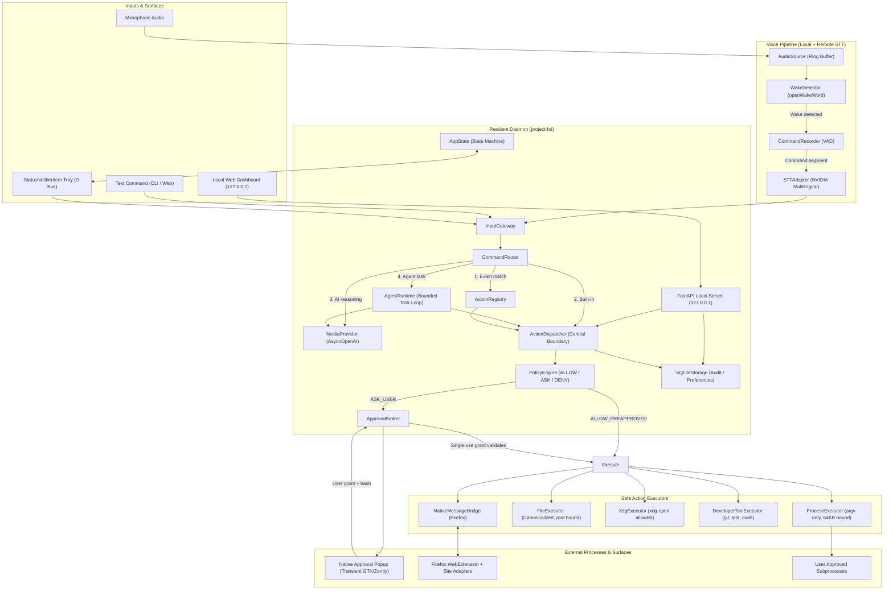

# Maya Final PH-180 System Architecture

## 1. End-State Architectural Overview

Project H (Maya) is a personal local-first computer assistant for Ubuntu Linux that pairs deterministic local automation with remote reasoning models strictly when reasoning is required.

---

## 2. Process Architecture

### 2.1 Resident Daemon (`project-hd`)
A single, long-running resident Python process running under systemd user mode:
- Memory target: `MemoryHigh=240M`, `MemoryMax=300M`.
- Event loop: standard `asyncio`.
- Components hosted: Core state machine, input gateway, command router, action registry, policy engine, approval broker, action dispatcher, executors, FastAPI server (127.0.0.1), SQLite audit/config storage, D-Bus StatusNotifierItem client, and wake audio monitoring.

### 2.2 Transient Subprocesses
- **Native Approval Popup:** Spawned on demand when an action resolves to `ASK_USER`. Terminates immediately after user response or timeout.
- **User Commands:** Sandboxed processes spawned via `ProcessExecutor` with argv-only isolation.
- **Native Messaging Host:** Launched by Firefox via standard WebExtension native messaging stdin/stdout framing.
- **Web Browser Tab:** Optional user dashboard viewed in default browser on `http://127.0.0.1:8765`.
