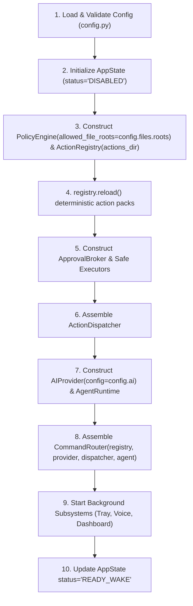

# Maya Composition Root & Lifecycle Management

## 1. Composition Root Architecture

The Maya resident daemon (`project-hd`) assembles all subsystems in a single composition root located at `app/lifecycle.py` (introduced in PH-050 as foundation, extended across phases, and hardened under cgroup limits in PH-160).



---

## 2. Deterministic Startup Sequence (Real APIs)

```python
"""app/lifecycle.py — Daemon Composition Root & Lifecycle Management."""

import asyncio
from dataclasses import dataclass
import logging
from pathlib import Path
from typing import Callable

from app.core.config import Config, load_config
from app.core.state import AppState
from app.core.dispatcher import ActionDispatcher
from app.policy.engine import PolicyEngine
from app.actions.registry import ActionRegistry
from app.executors.process import ProcessExecutor
from app.executors.files import FileExecutor
from app.executors.xdg import XdgExecutor
from app.browser.protocol import BrowserBridge

logger = logging.getLogger("project_h.lifecycle")


@dataclass
class MayaDaemonContext:
    config: Config
    state: AppState
    dispatcher: ActionDispatcher
    registry: ActionRegistry
    policy_engine: PolicyEngine
    shutdown_event: asyncio.Event


async def start_maya_daemon(config_path: Path, actions_dir: Path) -> MayaDaemonContext:
    """Initialize and assemble all Maya daemon subsystems using authoritative APIs."""
    # 1. Load validated configuration
    config = load_config(config_path)

    # 2. Initialize in-memory AppState with status DISABLED
    state = AppState(status="DISABLED")

    # 3. Construct PolicyEngine and ActionRegistry from verified real APIs
    policy_engine = PolicyEngine(
        allowed_file_roots=config.files.roots,
        preapproved_rules=[],
    )
    registry = ActionRegistry(actions_dir=actions_dir)
    diagnostics = registry.reload()
    if diagnostics:
        logger.warning("ActionRegistry reload diagnostics: %s", diagnostics)

    # 4. Construct safe executors
    process_exec = ProcessExecutor()
    file_exec = FileExecutor(allowed_roots=config.files.roots)
    xdg_exec = XdgExecutor()
    browser_bridge = None  # Instantiated when browser subsystem active (PH-110)

    # 5. Assemble Central Action Dispatcher
    dispatcher = ActionDispatcher(
        policy_engine=policy_engine,
        registry=registry,
        process_executor=process_exec,
        file_executor=file_exec,
        xdg_executor=xdg_exec,
        browser_bridge=browser_bridge,
    )

    # 6. Lifecycle coordination
    shutdown_event = asyncio.Event()

    context = MayaDaemonContext(
        config=config,
        state=state,
        dispatcher=dispatcher,
        registry=registry,
        policy_engine=policy_engine,
        shutdown_event=shutdown_event,
    )

    # 7. Transition AppState status to READY_WAKE
    state.update("status", "READY_WAKE")
    logger.info("Maya daemon initialized successfully in READY_WAKE status")
    return context
```

---

## 3. Subsystem Dependency & Injection Invariants

1. **System Tray Decoupling:** The system tray indicator (`app/tray/status_notifier.py`, PH-100) receives an injected asynchronous shutdown callback `Callable[[], Coroutine[Any, Any, None]]`, NOT a direct dependency on the concrete `LifecycleManager` or `start_maya_daemon`.
2. **Early Lifecycle Placement:** `app/lifecycle.py` is created in PH-050 as the structural composition root. PH-160 performs cgroup constraint hardening, stress testing, and child process accounting on this existing module.
3. **No Unregistered Config Sections:** Configuration attributes are sourced strictly from `config.assistant`, `config.voice`, `config.stt`, `config.ai`, `config.dashboard`, `config.agents`, `config.resources`, `config.privacy`, `config.browser`, and `config.files`. Any future configuration addition must be accompanied by explicit schema definitions in `app/core/config.py` and test coverage.

---

## 4. Graceful Shutdown Order

On receiving `SIGINT`, `SIGTERM`, or an explicit shutdown callback:

1. **Stop Audio Ingress:** Close `AudioSource` immediately to release the microphone device and prevent any new recording.
2. **Stop Input Gateways:** Reject incoming requests on command input channels and dashboard API.
3. **Cancel Pending Approvals:** Purge pending approvals in `ApprovalBroker`; unresolved requests fail closed to `DENY`.
4. **Abort Active Agent Tasks:** Cancel the active `asyncio.Task` running `AgentRuntime.run_task`.
5. **Drain Subprocesses:** Wait up to 3.0s for active `ProcessExecutor` child processes to complete; escalate to `SIGKILL` on timeout.
6. **Close Network Sessions:** Await `provider.aclose()` to close persistent HTTP/gRPC client sessions.
7. **Release Desktop & IPC Handles:** Unregister D-Bus SNI service and close Unix domain sockets.
8. **Flush Storage:** Perform SQLite WAL checkpoint and close database worker connections.
9. **Final State:** Update `state.update("status", "DISABLED")` and set `shutdown_event`.
