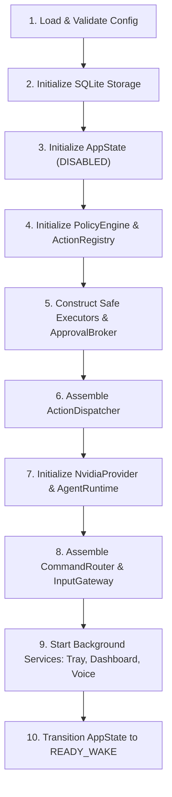

# Maya Composition Root & Lifecycle Management

## 1. Composition Root Architecture

The Maya resident daemon (`project-hd`) assembles all subsystems in a single composition root located at `app/lifecycle.py`.



---

## 2. Deterministic Startup Sequence

```python
async def start_maya_daemon(config_path: Path) -> MayaDaemonContext:
    # 1. Config
    config = load_config(config_path)
    
    # 2. Storage
    storage = SQLiteStorage(config.storage.db_path)
    await storage.connect()
    
    # 3. State
    state = AppState(initial_state=SystemState.DISABLED)
    
    # 4. Policy & Registry
    policy_engine = PolicyEngine(rules=config.policy)
    registry = ActionRegistry(packs_dir=config.actions_dir)
    await registry.load_all()
    
    # 5. Broker & Executors
    broker = ApprovalBroker(timeout_seconds=config.approval.timeout_seconds)
    process_exec = ProcessExecutor(allowed_roots=config.security.allowed_roots)
    file_exec = FileExecutor(allowed_roots=config.security.allowed_roots)
    xdg_exec = XdgExecutor()
    browser_bridge = NativeMessageBridge()
    
    # 6. Central Action Dispatcher
    dispatcher = ActionDispatcher(
        policy_engine=policy_engine,
        registry=registry,
        process_executor=process_exec,
        file_executor=file_exec,
        xdg_executor=xdg_exec,
        browser_bridge=browser_bridge,
        audit_sink=storage.record_audit_event,
    )
    
    # 7. AI Provider & Agent
    provider = NvidiaProvider(config=config.nvidia)
    agent = AgentRuntime(provider=provider, dispatcher=dispatcher)
    
    # 8. Command Router & Input Gateway
    router = CommandRouter(registry=registry, provider=provider, dispatcher=dispatcher, agent=agent)
    gateway = InputGateway(router=router, state=state)
    
    # 9. Background Subsystems
    tray = StatusNotifierTray(state=state, gateway=gateway)
    await tray.start()
    
    dashboard = DashboardServer(config=config, dispatcher=dispatcher, storage=storage)
    await dashboard.start()
    
    voice = VoiceWakeSubsystem(config=config.voice, gateway=gateway, state=state)
    if config.voice.always_listen:
        await voice.start_listening()
        
    # 10. Ready
    await state.transition_to(SystemState.READY_WAKE)
    return MayaDaemonContext(...)
```

---

## 3. Graceful Shutdown Order

On receiving `SIGINT`, `SIGTERM`, or an explicit Quit command:

1. **Stop Audio Stream:** Close `AudioSource` immediately to release microphone device.
2. **Stop Ingress:** Reject incoming requests on `InputGateway` and `DashboardServer`.
3. **Cancel Pending Approvals:** Purge `ApprovalBroker` pending requests, resolving ungranted commands to DENY.
4. **Abort Active Agent:** Gracefully signal cancellation to active `AgentRuntime` task.
5. **Drain Subprocesses:** Wait up to 3.0s for active `ProcessExecutor` child processes to complete; escalate to `SIGKILL` on timeout.
6. **Close Network Sessions:** `await provider.aclose()`.
7. **Unregister Tray:** Release D-Bus `StatusNotifierItem` registration.
8. **Flush Storage:** Perform SQLite checkpoint and close database connections.
9. **Final State:** Transition `AppState` to `DISABLED` and terminate asyncio event loop.
