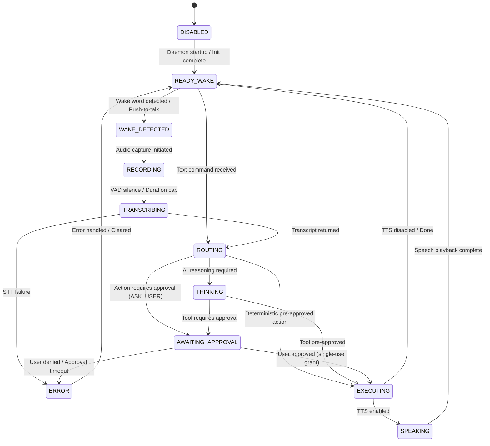

# Maya State Machines & Transition Tables

Maya strictly governs stateful execution via deterministic finite state machines (FSMs). Illegal state transitions are rejected with explicit exceptions.

---

## 1. System Lifecycle State Machine (`AppState`)

### Transition Table

| Current State | Event | Next State | Action / Side Effect | Illegal Transitions |
| :--- | :--- | :--- | :--- | :--- |
| `DISABLED` | `STARTUP_COMPLETE` | `READY_WAKE` | Start background listeners | Any except `READY_WAKE` |
| `READY_WAKE` | `WAKE_EVENT` | `WAKE_DETECTED` | Beep / Visual cue on tray | `EXECUTING`, `SPEAKING` |
| `WAKE_DETECTED` | `RECORD_START` | `RECORDING` | Open command audio buffer | `READY_WAKE`, `SPEAKING` |
| `RECORDING` | `VAD_STOP` | `TRANSCRIBING` | Send audio to STT | `READY_WAKE`, `EXECUTING` |
| `TRANSCRIBING` | `TRANSCRIPT_READY` | `ROUTING` | Pass text to CommandRouter | `READY_WAKE`, `SPEAKING` |
| `ROUTING` | `NEEDS_AI` | `THINKING` | Stream to NvidiaProvider | `DISABLED` |
| `ROUTING` | `NEEDS_APPROVAL`| `AWAITING_APPROVAL`| Spawn ApprovalPopup | `READY_WAKE` |
| `ROUTING` | `PREAPPROVED` | `EXECUTING` | Invoke ActionDispatcher | `READY_WAKE` |
| `AWAITING_APPROVAL`| `GRANT_ISSUED` | `EXECUTING` | Consume grant, run executor| `ROUTING`, `THINKING` |
| `AWAITING_APPROVAL`| `DENIED/TIMEOUT`| `ERROR` | Abort action, emit audit | `EXECUTING` |
| `EXECUTING` | `EXEC_COMPLETE` | `READY_WAKE` | Clean up subprocesses | `WAKE_DETECTED` |
| `ERROR` | `RESET` | `READY_WAKE` | Clear error flag | `EXECUTING` |

---

## 2. Approval Broker State Machine (`app/policy/broker.py`)

| Current State | Event | Next State | Cleanup / Invariant |
| :--- | :--- | :--- | :--- |
| `NONE` | `ACTION_EVALUATED_ASK_USER` | `PENDING_POPUP` | Generate action hash, register grant in memory |
| `PENDING_POPUP` | `POPUP_SPAWNED` | `WAITING_USER` | Start 60.0s async countdown timer |
| `WAITING_USER` | `USER_ALLOW_ONCE` | `GRANTED` | Token issued with exact payload hash |
| `WAITING_USER` | `USER_DENY` | `DENIED` | Delete grant, resolve promise with False |
| `WAITING_USER` | `TIMEOUT_EXPIRED` | `DENIED` | Kill popup process, emit timeout audit |
| `WAITING_USER` | `DAEMON_SHUTDOWN` | `INVALIDATED` | Memory cleared immediately; zero execution |
| `GRANTED` | `CONSUMED_BY_DISPATCHER` | `CONSUMED` | Atomically removed from memory; cannot be reused |
